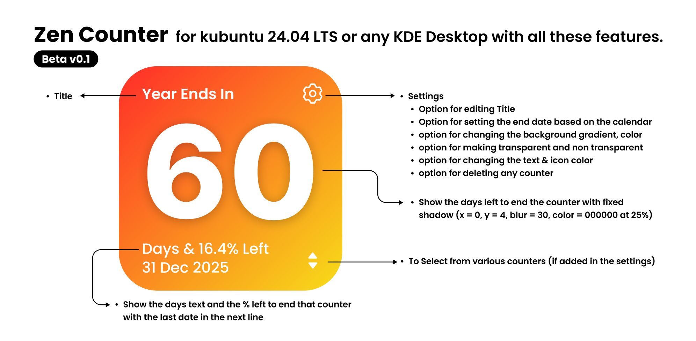

---

# 🕒 ZenCount – Minimal Countdown Widget for KDE Plasma

**ZenCount** is a modern and minimalist KDE Plasma widget designed to help you track events, goals, and milestones with elegance.
It allows you to **add, edit, delete, and manage multiple countdown timers** — all in a clean, intuitive interface that integrates beautifully with your desktop.

---


---
## 🌟 Features

* 🧘 **Minimal & Elegant UI** – Designed to feel native to KDE Plasma.
* ⏳ **Multiple Countdown Timers** – Track multiple goals or events.
* 🎨 **Dynamic Color Themes** – Each timer gets its own color accent.
* ⚡ **Real-Time Updates** – Auto-refresh every minute.
* 💾 **Persistent Data** – Timers are saved and restored automatically.
* 🖱️ **Interactive Controls** – Add, edit, or delete timers with one click.

---

## 📸 Working



## 📂 Folder Structure

```
org.chatgpt.zencount/
├── metadata.desktop
|-- assets
├── contents/
│   ├── ui/
│   │   └── main.qml
│   └── config/
│       ├── main.xml
│       └── config.qml
└── LICENSE
└── README.md
```

---

## ⚙️ Installation

### 🧩 Manual Install (Recommended for Development)

1. Create widget folder:

   ```bash
   mkdir -p ~/.local/share/plasma/plasmoids/org.kde.zencount
   ```
2. Copy all project files into that folder.
3. Run:

   ```bash
   plasmapkg2 -t plasmoid -i ~/.local/share/plasma/plasmoids/org.kde.zencount
   ```
4. If updating:

   ```bash
   plasmapkg2 -t plasmoid -u ~/.local/share/plasma/plasmoids/org.kde.zencount
   ```
5. Add it to your desktop or panel from **"Add Widgets" → ZenCount**.


---

## 🔧 Troubleshooting

If the widget doesn’t appear:

```bash
plasmapkg2 -t plasmoid -r org.chatgpt.zencount
plasmapkg2 -t plasmoid -i ~/.local/share/plasma/plasmoids/org.chatgpt.zencount
kquitapp5 plasmashell && kstart5 plasmashell
```

**Common issues:**

* ❌ *Expected token numeric literal*: Check for extra characters before `import QtQuick` in `main.qml`.
* 🧩 Widget not listed: Ensure `metadata.desktop` is valid and uses correct `X-KDE-PluginInfo-Name`.

---

## 🧑‍💻 Developer Notes

ZenCount is built with:

* **QML / QtQuick 2.15**
* **Plasma Components 3.0**
* **PlasmaCore**
* **Declarative Applet Scripting**

Goal: Keep it **lightweight**, **aesthetic**, and **hackable**.

---

## 📜 License

Released under the **GPL-3.0 License**.
You’re free to modify and redistribute with credit.

---

## ❤️ Contribute

Pull requests are welcome!
If you find bugs or have feature ideas, open an [issue](../../issues) or submit a PR.

---
